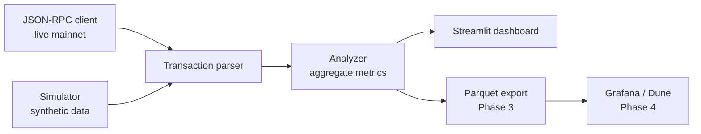

# Keyed Nonce Adoption Tracker

[](https://github.com/Zergal84/keyed-nonce-tracker/actions/workflows/ci.yml)
[](https://www.python.org)
[](LICENSE)
[](tests/)
[](tests/)
[](pyproject.toml)
[](pyproject.toml)

A Python dashboard for tracking EIP-8250 keyed-nonce adoption on Ethereum mainnet once the Glamsterdam upgrade activates the new transaction-nonce format.

## What is EIP-8250?

EIP-8250 replaces the linear nonce on frame transactions with a `(nonce_key, nonce_seq)` pair. Transactions on different non-zero keys are replay-independent, so a single sender address can run several parallel nonce streams. The main beneficiaries are privacy protocols, smart wallets, and intent settlement infrastructure, where the current linear-nonce model creates head-of-line blocking: one stuck transaction blocks every later transaction from the same sender.

Spec: https://eips.ethereum.org/EIPS/eip-8250

For the full dependency chain (EIP-8141 frame transactions, EIP-8266 expiring nonces, EIP-7928 block access lists), see [docs/EIP-8141-dependency-map.md](docs/EIP-8141-dependency-map.md). For the timing argument and why this needs to ship before Glamsterdam mainnet rather than after, see [docs/WHY-NOW.md](docs/WHY-NOW.md).

## What this tool does

Once Glamsterdam ships, the tracker reads mainnet blocks via JSON-RPC and computes:

- adoption rate per block and per day, both transaction-level and sender-level
- `NONCE_MANAGER` storage growth, with slot allocations gated by `KEYED_NONCE_FIRST_USE_GAS = 20000`
- estimated throughput uplift for shared senders that actually use parallel keys
- per-key sequence distance from `MAX_NONCE_SEQ = 2**64 - 1` (key-exhaustion monitor)
- shared-sender usage patterns consistent with privacy protocols or intent settlement

Before Glamsterdam activates, the same code paths run against a synthetic data generator instead of mainnet.

## Architecture



The simulator and the live client both produce `KeyedNonceTransaction` objects with the same shape, so everything downstream is data-source agnostic. When Glamsterdam ships and the new fields land on RPC, only one mapping function in `src/rpc_client.py` needs to flip over.

## Quickstart

```bash
pip install -e ".[dev]"
streamlit run src/dashboard.py
```

The dashboard opens at `http://localhost:8501`. Use the sidebar to switch between simulator mode (default) and live mode (set the `RPC_URL` env var to a Glamsterdam-aware node).

## Performance

Measured on a Windows laptop, Python 3.14, single-threaded, no PyPy:

| Workload | Time | Throughput |
|---|---|---|
| Simulate 200 blocks (29,434 txs, 5000 senders) | 423 ms | 70k txs/sec |
| Aggregate 29,434 txs into adoption metrics | 35 ms | 840k txs/sec |
| Bucket 29,434 txs into 50-block windows | 40 ms | 736k txs/sec |
| End-to-end (simulate + aggregate + bucket) | 498 ms | mainnet-comparable workload runs in half a second |

200 blocks is roughly a 40-minute window of current mainnet (about 150 txs/block). The analyzer is comfortable processing days of historical data in seconds. Reproduce locally with `python scripts/bench.py`.

## Testing

```bash
pytest tests/                           # all tests
pytest tests/ --cov=src                 # with coverage report
ruff check src/ tests/                  # lint
mypy src/                               # type-check (strict)
```

20 tests, 100% line coverage on all non-UI modules (analyzer, simulator, RPC client, data models). The dashboard is intentionally not covered because Streamlit's interactive surface does not test well with unit tests; live-mode integration testing arrives in Phase 2 via a Glamsterdam testnet validation harness.

CI runs the full suite plus ruff and mypy on Python 3.10, 3.11, 3.12, and 3.13 against every push and pull request. See [`.github/workflows/ci.yml`](.github/workflows/ci.yml).

## Roadmap

| Phase | Description | Status |
|---|---|---|
| 1 | Simulator, analyzer, dashboard, 20 unit tests, CI | done |
| 2 | Live RPC client wired into the dashboard, testnet validation report | stubbed, waits on a Glamsterdam testnet |
| 3 | Historical backfill from Glamsterdam genesis into Parquet | planned |
| 4 | Hosted dashboard, Grafana panel, Dune query template | planned |

See [CHANGELOG.md](CHANGELOG.md) for the v0.1.0 release notes, and [docs/ESP_PROPOSAL.md](docs/ESP_PROPOSAL.md) for the EF ESP Glamsterdam Round application.

## Contributing

See [CONTRIBUTING.md](CONTRIBUTING.md). PRs welcome, especially when the EIP-8250 spec text moves and the RPC client mapping needs updating.

## License

Apache-2.0. See [LICENSE](LICENSE).

## Status

EIP-8250 is still a draft. Some of the constants and field names may shift during Glamsterdam scoping, and the EIP itself may or may not land in the final scope. If the spec changes, the parser in `src/rpc_client.py` is the one place that needs updating.
